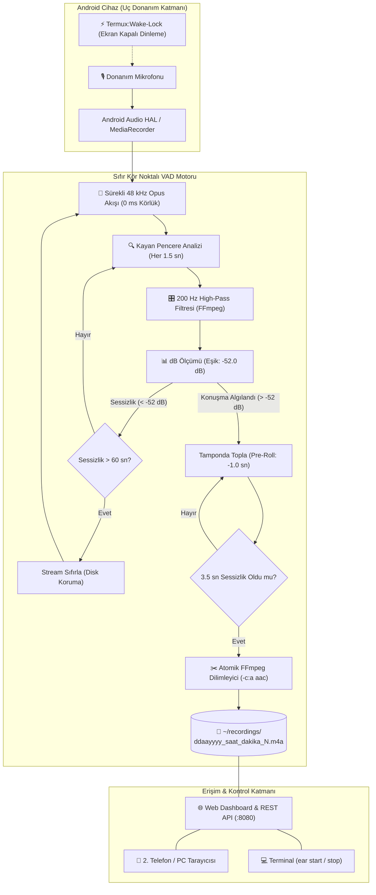
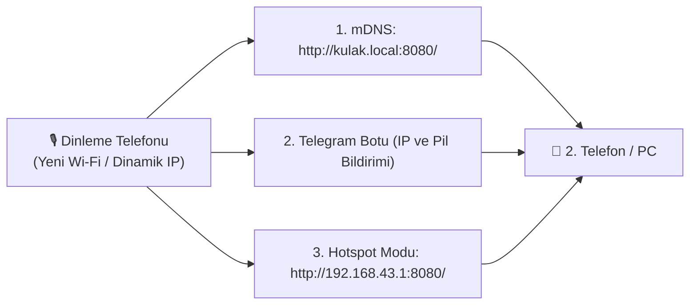

# 🎙️ Autonomous Audio Node (Otonom Ortam Dinleme ve VAD Düğümü)

> **Ekran kapalıyken bile kesintisiz (0 ms körlük) ortamı dinleyen, insan konuşmasını gürültüden ayıran, konuşmaları otomatik bloklar halinde kaydeden ve web üzerinden canlı yönetilen uç bilişim (Edge AI) sistemi.**

[](#)
[](#)
[](#)
[](#)

---

## 🌟 Neden Bu Proje?

Piyasadaki birçok ses kayıt uygulaması ekran kapandığında Android'in güç yönetimi (`Doze mode`) tarafından uyutulur veya ses eşiği aşıldığında mikrofonu açıp kapatırken **1-2 saniyelik kör noktalar** bırakarak konuşmaların başını keser.

**Autonomous Audio Node**, bu sorunları aşmak için özel olarak tasarlanmış bir uç donanım (Edge Node) yazılımıdır:
* **Sıfır Kör Nokta (Zero-Gap):** Mikrofonu sürekli açıp kapatmak yerine arka planda kesintisiz 48 kHz Opus akışı alır.
* **Pre-Roll (Kelime Başı Koruma):** Konuşma başladığı anı 1 saniye geriden alarak cümlenin ilk hecesini/kelimesini asla kaçırmaz.
* **Akustik Gürültü Filtresi:** 200 Hz yüksek geçiren filtre (High-Pass) ile klima, fan ve sokak uğultularını eler.
* **Çarpışmasız & Atomik İsimlendirme:** `ddaayyyy_saat_dakika_N.m4a` formatında asla bozulmayan, üst üste yazmayan ve çakışmayan kayıt blokları oluşturur.
* **Tek Dokunuşla Kontrol:** İster tarayıcıdan (Web UI), ister terminalden, ister Android bildirim çubuğundan tek tıkla açılıp kapatılır.

---

## 🏗️ Sistem Mimarisi ve Veri Akışı



---

## 🚀 1-Komutla Kurulum (Herhangi Bir Android Telefonda)

Yeni bir Android telefona kurulum yapmak yalnızca 1 dakika sürer:

1. Telefondan **F-Droid** üzerinden **Termux** ve **Termux:API** uygulamalarını yükleyin.
2. Termux'u açıp şu tek komutu yapıştırın ve Enter'a basın:

```bash
pkg install -y git && git clone https://github.com/ozunekmekci/autonomous-audio-node.git && cd autonomous-audio-node && ./install.sh
```

Kurulum bittiğinde terminal ekranında doğrudan erişim linki görüntülenecektir:
```text
============================================================
  ✅ KURULUM BAŞARIYLA TAMAMLANDI!
============================================================
🌐 Web Kontrol Paneli:  http://192.168.1.38:8080/
🌐 mDNS Bağlantısı:     http://kulak.local:8080/

📲 Terminal Komutları:
   dinle  -> Dinlemeyi başlatır
   dur    -> Mikrofonu tamamen kapatır
   durum  -> Canlı durumu gösterir
============================================================
```

---

## 🌐 Farklı Wi-Fi Ağlarında Cihazı Bulma Çözümleri

Telefon farklı bir Wi-Fi ağına bağlandığında yerel IP adresi değişebilir. Bu problemi çözmek için 3 pratik yöntem geliştirilmiştir:



### 1. Yerel İsim (mDNS - Önerilen)
Aynı Wi-Fi ağındaysanız IP adresini ezberlemenize gerek yoktur. Tarayıcınıza doğrudan şunu yazın:
👉 **`http://kulak.local:8080/`**

### 2. Telegram Bot Bildirimi (En Pratik)
`config.py` dosyasında Telegram ayarlarını etkinleştirdiğinizde, telefon yeni bir Wi-Fi'a bağlandığı anda Telegram'ınıza otomatik mesaj gelir:
> 🟢 **Ortam Dinleme Düğümü Çevrimiçi!**  
> 🌐 **Yeni IP:** `http://192.168.0.45:8080/`  
> 🔋 **Pil:** %84

### 3. Hotspot Modu (İnternetsiz / Her Yerde)
Eğer Wi-Fi modem yoksa, dinleme telefonunun Mobil Erişim Noktasını (Hotspot) açın. 2. telefonla bu ağa bağlandığınızda IP adresi Android standardı gereği her zaman sabittir:
👉 **`http://192.168.43.1:8080/`**

---

## 📱 Kullanım Rehberi

### A) Web Kontrol Paneli Üzerinden (Görsel ve Kolay)
Tarayıcınızdan `http://<TELEFON-IP>:8080/` adresine girin:
* **[▶ DİNLEMEYİ BAŞLAT]:** Mikrofonu açar, bildirim çubuğunda simge belirir ve ekran kapansa bile kayda hazır bekler.
* **[⏹ DİNLEMEYİ DURDUR]:** Donanımsal mikrofonu anında kapatır, yeşil nokta söner, sistem uykuya geçer.
* **Canlı Ses Oynatıcı:** Oluşan tüm ses dosyalarını sayfayı terk etmeden dinleyebilir veya indirebilirsiniz.

### B) Bilgisayar Terminalinden
Bilgisayarınızda repo dizinindeyken:
```bash
./ear.sh start    # Dinlemeyi başlatır
./ear.sh stop     # Mikrofonu anında kapatır
./ear.sh status   # Canlı durumu ve son kayıtları gösterir
```

### D) Telegram Üzerinden Uzaktan Kumanda (Dünyanın Her Yerinden)
Telegram botunuz (@Kulak_znbot) üzerinden aynı Wi-Fi ağında olmasanız bile dokunmatik menüyle kontrol sağlayabilirsiniz:
* **[▶ Dinlemeyi Başlat]:** Dinlemeyi açar ve cihazı tam sessizlik moduna alır.
* **[⏹ Dinlemeyi Durdur]:** Mikrofonu donanımsal olarak kapatır.
* **[📊 Canlı Durum / Pil]:** Anlık pil yüzdesi, şarj durumu, sıcaklık ve disk alanını raporlar.
* **[🎙️ Son Kaydı Gönder]:** En son kaydedilen ses dosyasını sesli mesaj olarak sohbete gönderir.

---

## 🛡️ Donanım Nöbetçisi (Edge Guard) & Güvenlik

| Özellik | Nasıl Çalışır? | Ne Sağlar? |
| :--- | :--- | :--- |
| **Sıfır Kör Nokta** | 48 kHz sürekli Opus stream | Parçalı kayıtlar gibi kelime atlaması yapmaz. |
| **Pre-Roll Koruması** | 1.0 sn geriden dilimleme | Cümlenin ilk harfi/hecesi asla kesilmez. |
| **Tam Sessizlik Modu** | Zil, bildirim, sistem sesleri = 0 | Masada titreme veya bildirim sesiyle yalancı tetiklemeyi önler. |
| **Şarj & Pil Koruyucu** | %10'da güvenli durdurma & standby | Cihazın aniden kapanmasını önler; prize takılınca mikrofon kapalı başlar. |
| **Termal Koruma & Hafıza** | 43°C uyarı, 46°C durdurma, 38°C devam | Donanımı korur; soğuyunca kaldığı yerden otomatik dinlemeye devam eder. |
| **Atomik Taşıma** | POSIX `os.replace` | Elektrik gitse bile asla yarım/bozuk 0 KB dosya oluşmaz. |
| **Otomatik Ses Dağıtımı** | Telegram `sendVoice` kuyruğu | Konuşmaları anında telefonunuza sesli mesaj olarak iletir. |
| **Çakışma Önleme** | Disk doğrulamalı ardışık numara | Aynı dakikada 100 kayıt gelse bile dosyalar birbirini ezmez. |


---

## 🗺️ Yol Haritası (Roadmap)

- [x] **Aşama 1: Kesintisiz VAD & Web Yönetim Düğümü** (Tamamlandı)
- [ ] **Aşama 2: STT (Speech-to-Text) Entegrasyonu** (Groq / OpenAI Whisper ile anında metne dökme)
- [ ] **Aşama 3: LLM Analiz Hattı** (Konuşma özeti, görev ve aksiyon maddeleri çıkarma)
- [ ] **Aşama 4: Cloud Telemetri & MQTT Heartbeat**

---

## 📄 Lisans
Bu proje [MIT Lisansı](LICENSE) altında açık kaynak olarak paylaşılmıştır.
